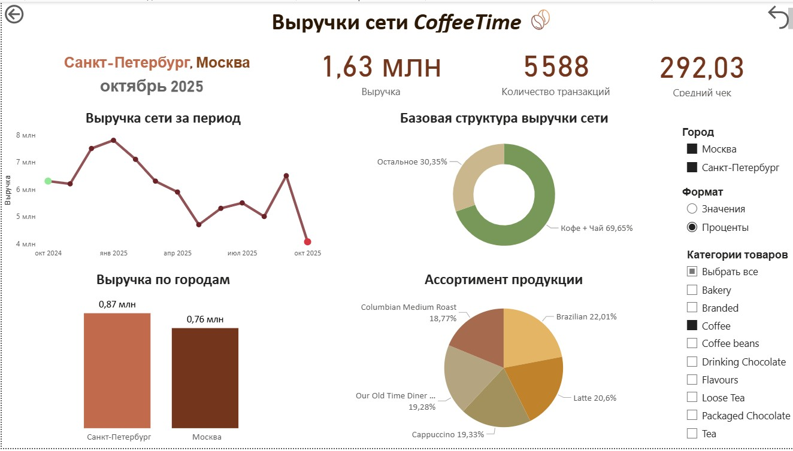
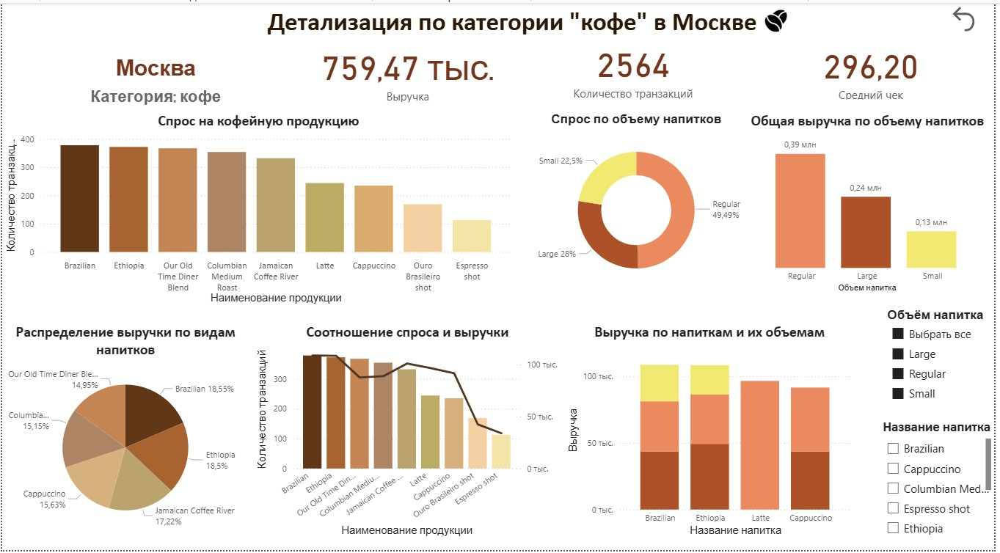

# Анализ продаж сети кофеен

## Описание

Анализ данных о транзакциях сети кофеен.  
Цель — определить структуру продаж, выявить наиболее прибыльные категории продукции и исследовать целевую аудиторию для формирования рекомендаций по развитию сети.

## Данные

Датасет содержит информацию о транзакциях, товарах и клиентах из CRM-системы. Включает: идентификатор транзакции, количество и цену товара, информацию о товаре (категория, название), информацию о кофейне (город), информацию о покупателе (дата рождения, пол), общую сумму чека.

## Задачи

1. Очистка и предобработка данных
2. Распаковка вложенных JSON-структур
3. Расчет дополнительных признаков (возраст, общая сумма чека)
4. Анализ структуры продаж по сети
5. Выявление наиболее прибыльных категорий
6. Исследование целевой аудитории

## Инструменты

- Python 3
- pandas, numpy
- matplotlib, seaborn
- json
- Google Colab

## Этапы работы

1. Загрузка данных
2. Предобработка:
   - Распаковка JSON-полей (product_info, store_info, customer_info)
   - Удаление дубликатов
   - Преобразование типов данных (birthdate → datetime)
   - Расчет возраста и общей суммы чека
   - Форматирование текстовых данных (store_city)
3. Анализ количественных признаков (возраст, сумма чека)
4. Анализ категориальных признаков (пол, город, категория товара)
5. Анализ взаимосвязей:
   - возраст — сумма чека
   - возраст — пол — город
   - категория товара — сумма чека
   - город — сумма чека
   - возрастная группа — категория товара
   - пол — категория товара

## Основные выводы

### Структура продаж
- Москва — 65% транзакций (2 точки), Санкт-Петербург — 35% (1 точка)
- Топ-3 категорий по выручке: Coffee, Tea, Bakery
- Coffee — лидер продаж (~40% всех покупок)
- Наименее популярные категории: Loose Tea, Packaged Chocolate, Branded, Coffee beans

### Целевая аудитория
- Основные клиенты — 31–50 лет (43%) и 50+ (40%)
- Молодежь до 30 лет — только 17%
- Женщины — 44%, мужчины — 33%, не указан — 23%
- В Москве клиенты моложе (медиана 42 года), в СПб — старше (медиана 50 лет)

### Взаимосвязи
- Сумма чека не зависит от возраста покупателя
- Средний чек на кофе выше, чем на чай и выпечку
- В Москве средние чеки немного выше, чем в СПб
- Кофе и чай — ведущие категории во всех возрастных группах

## Рекомендации

1. Сделать акцент на развитии категорий Coffee и Tea
2. Рассмотреть расширение сети в Санкт-Петербурге
3. Привлечь молодую аудиторию (20–30 лет) через соцсети и программу лояльности
4. Адаптировать ассортимент под женскую аудиторию

## Дополнительно: Дашборд в Power BI
Дашборд построен на синтетических данных и демонстрирует навыки работы в Power BI: создание мер, визуализаций, настройка фильтров и взаимодействие между элементами.

